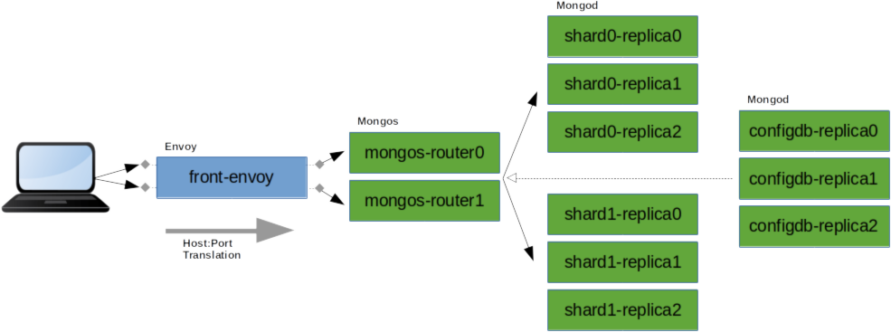

# Example Project Demonstrating an Envoy Proxy Fronting a MongoDB Sharded Cluster

The primary purpose of this project is to show how a proxy can be used to front a MongoDB cluster, as long as the cluster is sharded and the Mongos processes sit between the proxy and the Mongod shards (proxying a simple non-sharded replica set will not work). There can be a variety of reasons why a proxy is used between a MongoDB database and its clients, which requires host and/or port translation, including:

1. Bridging from one network to another (eg. internet to intranet or vice versa)
2. Providing a place in the deployment topology where additional monitoring can occur for increased observability.
3. Providing an additional layer of security and access control in the deployment topology

This example uses a [Docker](https://docs.docker.com/) [Compose](https://docs.docker.com/compose/overview/) project to launch the [MongoDB cluster](https://docs.mongodb.com/manual/sharding/) topology shown below, with [Envoy](https://www.envoyproxy.io/) proxy endpoints positioned in front of the Mongos processes.



Each element in the topology (9 Mongod processes, 2 Mongos processes, 1 Envoy process) runs in its own Docker container and all the containers are visible to each other on the same _internal_ network. Once running, the MongoDB cluster is accessible directly from your laptop/PC, via localhost forwarded ports which connect to the Envoy proxy endpoints.


## Prerequisites

* Your workstation is running a recent version of Linux, Windows or Mac OS X
* [Docker](https://docs.docker.com/install/) is already installed on your workstation
* [Docker Compose](https://docs.docker.com/compose/install/) is already installed on your workstation
* The [MongoDB Shell](https://docs.mongodb.com/mongodb-shell/install/) is already installed on your workstation to you to issue commands to the running database cluster from your workstation (alternatively use the [MongoDB Compass](https://docs.mongodb.com/compass/current/install/) graphical tool to connect to the cluster)


## Build, Run & Connect

1. Launch a command line terminal in the base _envoy-sharded-mongodb_ folder and execute the following command to build and start all the containers in the Docker Compose project:
```
sudo docker-compose up --build -d
```
2. Show all the running docker containers for this Docker Compose project:
```
sudo docker-compose ps
```
3. Connect to the MongoDB cluster from the MongoDB Shell (the Shell should connect to the first of the two configured Envoy proxy endpoints, which then connects to the first Mongos, which then connects to the Mongod shards):
```
mongosh --port 27000
```
```
sh.status()
```
_Note_: Use port 27001 instead, above, if you want to connect to the second Envoy endpoint which will connect to the second Mongos. Attempting to configure Envoy to _load balance_ across the two Mongos proxies, to represent them as a _single_ endpoint, will break the MongoDB wire protocol communication between the Shell and the Mongos processes.


## Tips

* To show the container logs for the Envoy proxy, run:
```
sudo docker-compose logs front-envoy
```
* To show the container logs for one of the Mongos servers, run:
```
sudo docker-compose logs mongos-router0
```
* To execute a terminal session directly in the Envoy proxy's container and then view the Envoy access logs for requests sent to the two Mongos processes, run:
```
sudo docker-compose exec front-envoy /bin/bash
```
```
cat /tmp/access0.log
cat /tmp/access1.log
```
* To execute a terminal session directly in one of the Mongos containers and then execute the MongoDB Shell directly accessing the local Mongos process, run:
```
sudo docker-compose exec mongos-router0 /bin/bash
```
```
mongosh
```
* To execute a terminal session directly in one of the Mongod containers and then view the Mongod process' logs, run:
```
sudo docker-compose exec shard0-replica0 /bin/bash
```
```
cat /data/db/mongod.log
```
* To view the Envoy proxy's collected runtime statistics, in a browser go to: [http://localhost:8001/stats](http://localhost:8001/stats)

* To shutdown and remove all the Docker Compose project's running containers (ready for you to rebuild and run again), run:
```
sudo docker-compose down
```

